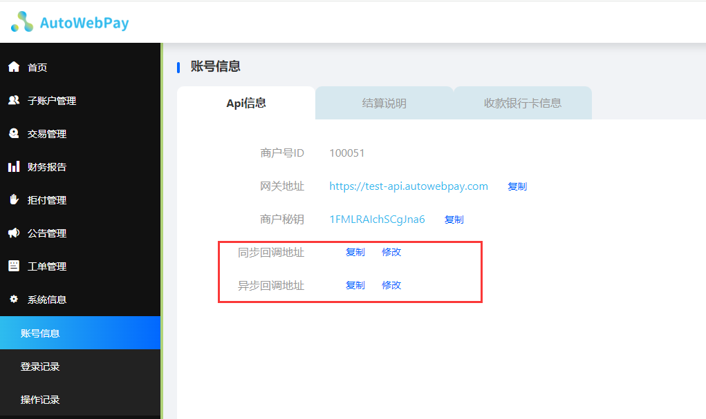

## 目录

- [平台账号颁发](#平台账号颁发)
- [API文档](#api文档)
   - [环境URL](#环境url)
   - [安全校验规则](#安全校验规则)
   - [订单查询接口](#订单查询接口)
   - [订单创建接口](#订单创建接口)
- [注意事项](#注意事项)
- [API错误信息](#api错误信息)
- [同步回调数据结构](#同步回调数据结构)
- [异步回调数据结构](#异步回调数据结构)
- [测试卡号](#测试卡号)
- [常见问题](#常见问题)

<div STYLE="page-break-after: always;"></div>


## 平台账号颁发

__1.商户 主邮箱__:商户需要提供一个邮箱作为主邮箱 , 后续登录商户平台使用

__2.商户 ip__ : 鉴于安全性验证 , 商户需要提供ip地址 , api服务接口会进行ip校验 , 只放行白名单内的ip , 允许多个

__3.商户 主域名__ : 鉴于安全性验证 , 商户提供主域名 , 格式为 www.xxx.com , 需要提供 xxx.com 结构的主域名 , 服务在提供支付页后 , 当用户打开支付页链接时 , 服务会验证上一级域名是否在服务白名单中 , 若不存在的域名会被拒绝验证 , 允许多个

__4.回调地址__ : 商户在收到平台派发的账号信息后 , 应到对应环境的商户后台的系统信息中配置同步回调地址及异步回调地址


<div STYLE="page-break-after: always;"></div>


## api文档:

## 1.生产和测试域

|环境| api                             |
|---|---------------------------------|
|生产| https://api.autowebpay.com      |
|测试| https://test-api.autowebpay.com |

|环境| 商户平台                            |
|---|---------------------------------|
|生产| https://merchant.autowebpay.com      |
|测试| https://test-merchant.autowebpay.com |

<div STYLE="page-break-after: always;"></div>


## 2.安全校验规则
请求api接口时 , 所有接口存在统一校验规则 , 所有接口必须携带以下请求头

| 字段名         |类型| 描述                 |
|-------------|---|--------------------|
| X-SID       |String| 商户识别id             |
| X-TOKEN     |String| 商户识别token          |
| X-TIMESTAMP |String| 请求时间戳(ms) 13位gmt+0 |
| X-ALG       |String| 请求密文               |


1.将自然排序后的参数名和参数值按 key=value 格式拼接，并⽤ & 连接成字符串，形成待签名字符
串。(注意：不包括返回的signature签名字段参数，该参数不参与签名计算,只用于验签校验)

> 此⽰例不为固定格式，实际情况请根据具体返回参数：
> 
> cardBank=MasterCard&cardNo=511100XXXXXX1128&cardType=MC&currencyType=USD&merchantOrderNo=202406201649996d95e00&orderNo=4908675497A2024062008&payAmount=2000&payChannelType=2&payName=MARTY Tang&status=1&tranNo=4908675497A2024062008&transactionDate=1718873602784


> java实列代码如下：

````
    //设置请求头，包含必须的识别信息和时间戳等
    HttpHeaders headers = new HttpHeaders();
    headers.setContentType(MediaType.APPLICATION_JSON);
    headers.set("X-SID", X_SID); // 商户识别id
    headers.set("X-TOKEN", X_TOKEN); // 商户识别token
    final String timestamp = String.valueOf(System.currentTimeMillis());
    headers.set("X-TIMESTAMP", timestamp); // 请求时间戳13位，gmt+0当时间戳超过当前时间5分钟,请求将被拒绝

    //将自然排序后的参数名和参数值按 key=value 格式拼接，并⽤ & 连接成字符串
    Map<String, String> sortedParams = new TreeMap<>(params);
    StringBuilder stringToSign = new StringBuilder();
    for (Map.Entry<String, String> entry : sortedParams.entrySet()) {
        if (StringUtils.isEmpty(entry.getValue())) {
            continue;
        }
        stringToSign.append(entry.getKey()).append("=").append(entry.getValue()).append("&");
    }
    // 移除最后⼀个"&"
    stringToSign.deleteCharAt(stringToSign.length() - 1);
    log.info("stringToSign======:"+stringToSign);
    //md5运算拼接顺序为 sign + propertie(排序拼接后的key,value值)
    headers.set("X-ALG", DigestUtils.md5Hex(sign + propertie));
````

2.商户识别id,商户识别token,商户sign由平台颁发,如不清楚请联系商户对接人

3.X-TIMESTAMP请求时间戳(ms),当时间戳超过当前时间5分钟,请求将被拒绝


<div STYLE="page-break-after: always;"></div>


## 3.订单查询接口

> method: POST
> 
> path: /merchant-api/v2/queryOrder
> 
> Content-Type: application/json
> 
> 请求示例
> 
> https://test-api.autowebpay.com/merchant-api/v2/queryOrder
> ```json
> {
>  "orderNo": "1812398161A2024060611",
>  "timestamp": 1718877388136
> }
> ```


 
### 请求参数

| 名称        |位置|类型|必选| 说明            |
|-----------|---|---|---|---------------|
| orderNo   |query|string| 是 | 平台订单id（tranNo） |
| timestamp |query|string| 是 | 时间戳需要和请求头X-TIMESTAMP一致 |        |

### 返回参数

| 参数名             | 类型              |必选| 描述                          |
|:----------------|:----------------|:-----|:----------------------------|
| status          | String          |Y| 状态码成功200                    |
| message         | String          |N| 响应信息，Success或错误提示语          |
| data            | OrderCallBackVo |N| 数据                          |
| merchantOrderNo | String          |Y| 商户订单id（关联订单号）               |
| tranNo          | String          |Y| 平台订单id                      |
| payUrl          | String          |Y| 支付地址                        |
| payAmount       | Long            |Y| 订单交易金额 (单位: 分)              |
| currencyType    | String          |Y| 货币类型 (USD-美金)               |
| status          | Integer         |Y| 支付状态  (1-成功,2-失败)      |
| countryCode     | String          |N| 交易国家                        |
| cardType        | String          |N| 卡类型                         |
| cardBank        | String          |N| 卡银行                         |
| cardNo          | String          |N| 支付卡号                        |
| payName         | String          |N| 付款人名称                       |
| failureDesc     | String          |N| 支付渠道返回的错误信息                 |
| extendData      | String          |N| 扩展数据                        |
| transactionDate | Date            |Y| 交易完成时间(GTM-0)               |
| refundStatus    | Date            |Y| 订单退款状态 (1-退款中,2-已退款,3-退款失败) |                 |
| signature       | String          |Y| 验签                          |


> 成功示例

```json
{
  "message": "Success",
  "data": {
    "tranNo": "101611721820A20230919",
    "payUrl": "https://pay.autowebpay.com/JD3736BB4IHJHA98HNE0UYMD773",
    "merchantOrderNo": "202309191015170564997",
    "payAmount": 100,
    "currencyType": "USD",
    "countryCode": "",
    "cardType": "MC",
    "cardBank": "MasterCard",
    "cardNo": "542288XXXXXX2007",
    "payName": "zac",
    "transactionDate": 1695090489000,
    "failureDesc": "",
    "extendData": "",
    "refundStatus": 2,
    "signature": "f7cdc13ac619b2e20ea84cd162a6fd93"
  },
  "status": "200"
}


```

<div STYLE="page-break-after: always;"></div>


## 4.订单创建接口

> method: POST
>
> path: /merchant-api/v2/3/createOrder
>
> Content-Type: application/json
> 
> 请求示例
>
> https://test-api.autowebpay.com/merchant-api/v2/3/createOrder
> 
>  ```json
> {
>   "orderNo": "S20240229231534177DEV",
>   "payAmount": "4000",
>   "currencyType": "USD",
>   "extendData": "",
>   "timestamp": 1718879359505,
>   "storedId": "token",
>   "ip":"101.44.82.72"
> }
> ```

#### 请求参数

| 名称           | 类型     |必选| 说明                                  |
|--------------|--------|---|-------------------------------------|
| orderNo      | string | 是 | 商户订单id（关联订单号）最小21位最大32位(仅数字及字母)     |
| payAmount    | string | 是 | 订单交易金额 (单位: 分)必须大于0                 |
| currencyType | string | 否 | 货币类型 (USD-美金)(默认USD)                |
| extendData   | string | 否 | 扩展数据 (用于商户扩展信息,支付完成后会完整返回,最大长度4096) |
| timestamp    | string | 是 | 时间戳需要和请求头X-TIMESTAMP一致              |        |
| storedId     | string | 否 | 记卡id(记卡返回的token)                    |        |
| ip           | string   | 是   | 用户真实请求IP地址                          |

#### 响应参数

| 参数名             | 类型              | 必选 | 描述                 |
|:----------------|:----------------|:---|:-------------------|
| status          | String          | Y  | 状态码成功200           |
| message         | String          | N  | 响应信息，Success或错误提示语 |
| data            | OrderResponseVo | N  | 数据                 |
| merchantOrderNo | String          | Y  | 商户订单id（关联订单号）      |
| tranNo          | String          | Y  | 平台订单id             |
| payUrl          | String          | Y  | 支付地址               |
| payAmount       | Long            | Y  | 订单交易金额 (单位: 分)     |
| currencyType    | Integer         | Y  | 货币类型 (USD-美金)      |
| extendData      | String          | N  | 扩展数据               |
| signature       | String          | Y  | 验签                 |

<div STYLE="page-break-after: always;"></div>

> 成功示例

```json
{
  "message": "Success",
  "data": {
    "tranNo": "101611721820A20230919",
    "payUrl": "https://pay.autowebpay.com/JD3736BB4IHJHA98HNE0UYMD773",
    "merchantOrderNo": "202309191015170564997",
    "payAmount": 100,
    "currencyType": "USD",
    "extendData": "",
    "signature": "f7cdc13ac619b2e20ea84cd162a6fd93"
  },
  "status": "200"
}
```

__注意事项__ :

1.正常情况下，支付地址所指向的支付页允许多次打开但只能提交一次有效支付请求,已提交的支付订单不可再次发起支付.

2.如若长时间停留支付页未操作支付，支付链接24小时后过期失效,请用户及时支付,失效后请重新发起支付.


<div STYLE="page-break-after: always;"></div>

## 4.退款接口（全额退）

> method: POST
>
> path: /merchant-api/v2/3/refund
>
> Content-Type: application/json
>
> 请求示例
>
> https://test-api.autowebpay.com/merchant-api/v2/3/refund
>
>  ```json
> {
>   "orderNo": "0102020072A2024072915",
>   "timestamp": 1718879359505
> }
> ```

#### 请求参数

| 名称           | 类型     |必选| 说明                                  |
|--------------|--------|---|-------------------------------------|
| orderNo      | string | 是 | 平台订单id（tranNo）     |
| timestamp    | string | 是 | 时间戳需要和请求头X-TIMESTAMP一致              |        |

#### 响应参数

| 参数名               | 类型              | 必选 | 描述                          |
|:------------------|:----------------|:---|:----------------------------|
| status            | String          | Y  | 状态码成功200                    |
| message           | String          | N  | 响应信息，Success或错误提示语          |
| data              | OrderResponseVo | N  | 数据                          |
| merchantOrderNo   | String          | Y  | 商户订单id（关联订单号）               |
| tranNo            | String          | Y  | 平台订单id                      |
| refundAmount      | Long            | Y  | 退款金额                        |
| refundStatus      | Integer         | Y  | 订单退款状态 (1-退款中,2-已退款,3-退款失败) |
| refundOrderNo     | String          | Y  | 退款订单号                       |
| signature         | String          | Y  | 验签                          |

<div STYLE="page-break-after: always;"></div>

> 成功示例

```json
{
  "message": "Success",
  "data": {
    "merchantOrderNo": "S202402725095895944DEV",
    "refundAmount": "40.00",
    "refundOrderNo": "T20240731161605828269",
    "refundStatus": 2,
    "signature": "996dc95c45ea688435acbcafaf4fe618",
    "tranNo": "0354064784A2024073018"
  },
  "status": "200"
}
```

<div STYLE="page-break-after: always;"></div>


## 5.api错误信息

| 错误码       | 错误                                               | 错误信息                    |
|-----------|--------------------------------------------------|-------------------------|
| MER1001   | AUTHENTICATION DATA EMPTY!                       | 请求头不合法,缺少请求头            |
| MER1003   | AUTHENTICATION DATA MATCH ERROR!                 | 商户信息没有匹配                |
| MER1004   | AUTHENTICATION ERROR!                            | 商户token错误               |
| MER1005   | AUTHENTICATION EXPIRE!                           | 商户账号过期 , 请联系平台管理员处理     |
| MER1006   | AUTHENTICATION REQUEST EXPIRE!                   | 请求逾时                    |
| MER1009   | ORDER AUTHENTICATION ERROR!                      | 请求头请求密文错误               |
| MER1007   | ORDER NUM DOES NOT COMPLY WITH THE RULES!        | 订单id格式异常(必须21位 ,仅数字及字母) |
| MER1008   | ORDER AMOUNT ERROR!                              | 订单金额异常 (单位: 分 , 必须大于0)  |
| MER1010   | ORDER CHANNEL ERROR!                             | 订单渠道异常 , 请联系平台管理员处理     |
| MER1011   | ORDER NUMBER DUPLICATION ERROR!                  | 订单no已存在                 |
| MER1012   | ORDER CURRENCY TYPE ERROR!                       | 订单货币类型异常                |
| MER1014   | CHANNEL ORDER CHECK ERROR!                       | 订单扩展数据异常                |
| MER1015   | LOWER THAN THE MINIMUM SINGLE LIMIT!             | 订单价格小于商户最小交易价格          |
| MER1016   | HIGHER THAN THE MAXIMUM SINGLE LIMIT!            | 订单价格高于最高单一限额！           |
| MER1017   | SINGLE-DAY TRANSACTION AMOUNT EXCEEDS THE LIMIT! | 单日交易金额超限！               |
| MER1018   | Not on File!                                     | 无档案！                    |
| MER1019   | ORDER NOT EXIST!                                 | 订单不存在！                  |
| MER1020   | STORED TOKEN ERROR!                              | 存储令牌错误！                 |


<div STYLE="page-break-after: always;"></div>


## 6.同步回调数据结构
用户在支付完成后 , 页面会跳转到商户配置的同步回调地址 , 此时会在url后携带以下数据

> 回调示例
> 
> https://{callBackUrl}?tranNo=101611721820A20230919&orderNo=202309191015170564997&status=1&extendData=1

| 参数名        | 类型      | 描述                    |
|------------|---------|-----------------------|
| tranNo     | String  | 	平台订单id               |
| orderNo    | String  | 	商户订单id               |
| status     | Integer | 支付状态 (1-成功,2-失败) |
| extendData | String  | 	扩展数据                 |

其中商户需要关注extendData这个参数 , 商户可以根据在extendData中设置不同的数据 , 以达到不同的结果页效果 , 比如商品类型 , 用户信息等

__注意事项 :__ 一般而言 , 由于同步回调依赖用户页面流转 , 往往同步请求会比异步请求更晚到达应用服务器
<div STYLE="page-break-after: always;"></div>


## 7.异步回调数据结构
在服务器确认到用户支付完成后 , 会向商户服务器发起回调 , 此时会向商户配置的异步回调地址发起POST请求并在body中以json结构携带以下参数

| 参数名             | 类型       | 描述                     |
|-----------------|-----------|------------------------|
| tranNo          | String    | 平台订单id                 |
| merchantOrderNo | String    | 商户订单id                 |
| payAmount       | Long      | 订单交易金额(单位: 分)          |
| payChannelType  | Integer   | 支付渠道类型                |
| currencyType    | String    | 货币类型 (USD-美金)          |
| status          | Integer   | 支付状态  (1-成功,2-失败) |
| countryCode     | String    | 交易国家                   |
| cardType        | String    | 卡类型                    |
| cardBank        | String    | 卡银行                    |
| cardNo          | String    | 支付卡号                   |
| payName         | String    | 付款人名称                  |
| failureDesc     | String    | 支付渠道返回的错误信息            |
| extendData      | String    | 扩展数据                   |
| transactionDate | Date      | 交易成功时间                 |
| signature       | String    | 验签                     |
| token           | String    | 用户记卡后返回记卡id            |

<div STYLE="page-break-after: always;"></div>

>成功示例

```json
{
    "message":"Success",
    "data":{
        "merchantOrderNo":"202309191015170564997",
        "payAmount":100,
        "currencyType":"USD",
        "extendData":"",
        "tranNo":"101611721820A20230919",
        "payUrl":"https://pay.autowebpay.com/JD3736BB4IHJHA98HNE0UYMD773",
        "status":1,
        "countryCode":"",
        "cardType":"MC",
        "cardBank":"MasterCard",
        "cardNo":"542288XXXXXX2007",
        "payName":"zac",
        "transactionDate":1695090489000,
        "failureDesc":null,
        "signature": "f7cdc13ac619b2e20ea84cd162a6fd93",
        "token": "1234567890"
    },
    "status":"200"
}

```

__注意事项 :__

1.一般而言 , 由于同步回调依赖用户页面流转 , 往往同步请求会比异步请求更晚到达应用服务器

2.异步回调重试机制为：5分钟，十分钟，半小时，一小时，两小时，两小时，每次最多延迟或者提前1分钟，最大重试6次

<div STYLE="page-break-after: always;"></div>

## 8.测试卡号

__注意事项 :__ 

1.本文档中的所有测试卡号仅可使用于AutowebPay测试环境,如果将该账号使用于生产环境,用户同意承担所有费用

2.部分卡号可能出于安全原因被禁用,若出现请尝试其他卡号

3.卡号到期日请填写未来的月份和年份

4.卡号认证CVV请使用对应位数的任意3位数字值即可（American Express卡为任意4位数，输入3位数可测试支付失败订单）

5.模拟下降支付卡可以模拟支付失败订单，具体请查看异步回调数据结构


####测试信用卡

| 卡类型                      | 卡号                      |
|--------------------------|-------------------------|
| Visa                     | 4242 4242 4242 4242     |
| Visa (debit)             | 4000 0566 5566 5556     |
| Mastercard               | 5555 5555 5555 4444     |
| Mastercard (2-series)    | 2223 0031 2200 3222     |
| Mastercard (debit)       | 5200 8282 8282 8210     |
| Mastercard (prepaid)     | 5105 1051 0510 5100     |
| American Express         | 3782 822463 10005       |
| American Express         | 3714 496353 98431       |
| Discover                 | 6011 1111 1111 1117     |
| Discover                 | 6011 0009 9013 9424     |
| Discover (debit)         | 6011 9811 1111 1113     |
| Diners Club              | 3056 9300 0902 0004     |
| Diners Club (14-digit)   | 3622 7206 2716 67       |
| BCcard and DinaCard      | 6555 9000 0060 4105     |
| JCB                      | 3566 0035 6600 3566     |
| JCB                      | 3528 0000 0000 0007     |
| UnionPay                 | 6200 0000 0000 0005     |
| UnionPay (debit)         | 6200 0000 0000 0047     |
| UnionPay (19-digit card) | 6205 5000 0000 0000 0004 |


####模拟下降

| 卡类型                       | 卡号                                       |
|---------------------------|-------------------------------------------|
| Visa                      | 4242 4242 4242 4242                        |
| Visa (debit)              | 4000 0566 5566 5556                        |
| Mastercard                | 5555 5555 5555 4444                        |
| Mastercard (2-series)     | 2223 0031 2200 3222                        |
| Mastercard (debit)        | 5200 8282 8282 8210                        |
| Mastercard (prepaid)      | 5105 1051 0510 5100                        |
| American Express          | 3782 822463 10005                         |
| American Express          | 3714 496353 98431                          |
| Discover                  | 6011 1111 1111 1117                        |
| Discover                  | 6011 0009 9013 9424                        |
| Discover (debit)          | 6011 9811 1111 1113                        |
| Diners Club               | 3056 9300 0902 0004                        |
| Diners Club (14-digit)    | 3622 7206 2716 67                           |
| BCcard and DinaCard       | 6555 9000 0060 4105                        |
| JCB                       | 3566 0035 6600 3566                        |
| JCB                       | 3528 0000 0000 0007                        |
| UnionPay                  | 6200 0000 0000 0005                        |
| UnionPay (debit)          | 6200 0000 0000 0047                        |
| UnionPay (19-digit card)  | 6205 5000 0000 0000 0004                   |


####无效数据

若要测试由无效数据导致的错误，请提供无效详细信息。你不需要一个特殊的测试卡。任何无效值都有效。

| 卡类型                  | 卡号                                 |
|----------------------|------------------------------------|
| invalid_expiry_month | 使用无效的月份，例如13。                      |
| invalid_expiry_year  | 使用过去最多50年的年份，例如95。                 |
| invalid_cvc          | 使用两位数，例如99。                        |
| incorrect_number     | 使用未通过Luhn检查的卡号，例如4242424242424241。 |


<div STYLE="page-break-after: always;"></div>

## 9.常见问题

1. 商户需要提供哪些信息才能使用平台账号？
    - 商户需要提供一个邮箱作为主邮箱，后续登录商户平台使用。
    - 鉴于安全性验证，商户需要提供IP地址，API服务接口会进行IP校验，只放行白名单内的IP，允许多个。
    - 商户在收到平台派发的账号信息后，应到对应环境的商户后台的系统信息中配置同步回调地址及异步回调地址。


2. 请求API接口时需要遵守哪些安全校验规则？
    - 所有接口存在统一校验规则，必须携带以下请求头：X-SID（商户识别id）、X-TOKEN（商户识别token）、X-TIMESTAMP（请求时间戳(ms)）和X-ALG（请求密文）。
    - X-ALG请求密文的格式需按顺序拼接：sign + timestamp + 参数组合（参数组合为请求参数的key首字母排序后， value值进行拼接）进行MD5运算。


3. 如何实现Java代码中的请求头设置？
    - 创建HttpHeaders对象并设置内容类型为MediaType.APPLICATION_JSON。
    - 设置必要的识别信息和时间戳等请求头字段：X_SID、X_TOKEN、X_TIMESTAMP。
    - 对请求参数的key首字母排序后， value值进行拼接，并进行MD5运算以生成X_ALG请求密文。


4. 如果不清楚商户识别id、商户识别token或商户sign，应该如何处理？
    - 如果不清楚这些信息，请联系商户对接人。


5. X-TIMESTAMP的作用是什么？如果时间戳超过当前时间5分钟会怎样？
    - X-TIMESTAMP是请求时间戳(ms)，用于验证请求的时效性。如果时间戳超过当前时间5分钟，请求将被拒绝。


6. 订单查询接口和订单创建接口分别用于什么目的？它们有哪些请求参数和响应参数？
    - 订单查询接口用于根据商户订单id查询订单详情。它有一个必需的请求参数merchantOrderNo（商户订单id）。
    - 订单创建接口用于创建新的支付订单。它有多个请求参数，包括orderNo（商户订单id）、payAmount（交易金额）、currencyType（货币类型）和extendData（扩展数据）。响应参数包括支付成功页面的链接、商户订单号、支付金额、货币类型等信息。


7. 同步回调和异步回调的区别是什么？它们的数据结构分别是怎样的？
    - 同步回调依赖于用户页面流转，往往比异步回调到达应用服务器更晚。它通过URL后携带tranNo、orderNo、status和extendData等数据。
    - 异步回调由服务器确认用户支付完成后发起，通常通过POST请求发送到异步回调地址，并在body中以json结构携带更多详细的支付状态信息和其他相关数据。


8. 回调地址在哪里填写？只填写一个可以吗？
    - 回调地址是商户平台系统信息中配置的，同步回调地址和异步回调地址都要填写，同步地址用于支付后跳转页面，异步回调推送支付完整参数商户需要根据请求参数进行业务处理。

